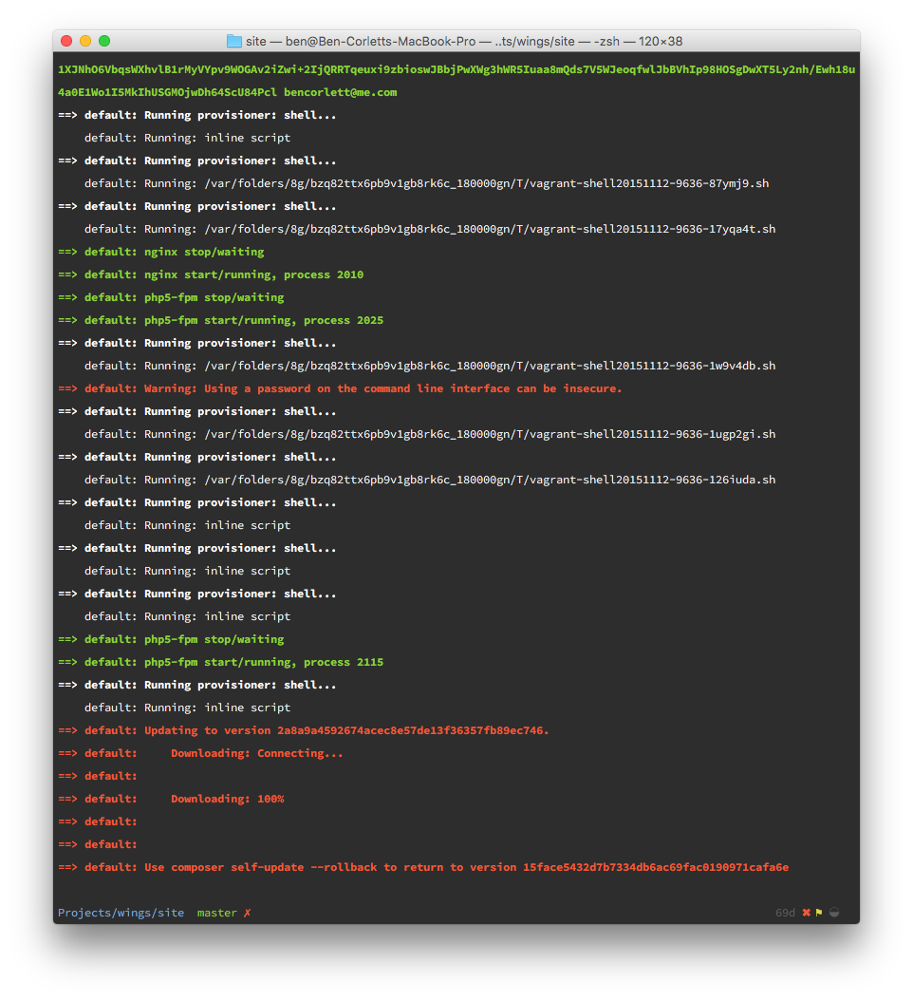

# Visits

## Prerequisites

You must ensure you have installed [Vagrant](https://www.vagrantup.com) to your system to run the locally installed distribution of [Laravel Homestead](http://laravel.com/docs/5.1/homestead).

It's also probably a good idea to maintain a decent [global gitignore](https://help.github.com/articles/ignoring-files/) file, with at least the following entries:

```
/vendor
/node_modules
```

## Cloning Repository

You will need to clone the [repository](https://github.com/matmegat/laravel-travel-portal) to your development environment:

```bash
git clone git@github.com:matmegat/laravel-travel-portal.git
```

## Provisioning Environment

You then need to provision the Homestead environment (which is built on Vagrant):

```bash
cd path/to/visits.com.au
vagrant up
```

You'll see a bunch of output:




Ensure you have added an entry for the development environemnt into your `/etc/hosts` file:

```
192.168.10.10 visits.dev
```

At this point, you can SSH into your Homestead environment!

```
vagrant ssh
```
